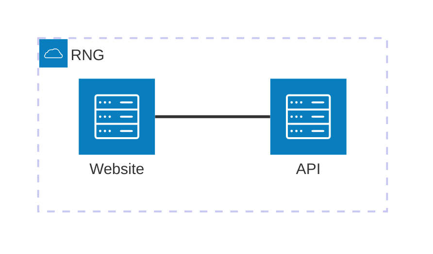

# Azure Container Instances

The great thing about Docker containers is they're portable - your app runs in the same way on Docker Desktop as it does on any other container runtime. Azure offers several services for running containers, and the simplest is Azure Container Instances (ACI) which is a managed container service. You run your apps in containers and you don't have to manage any of the underlying infrastructure.

## Reference

- [Run container images in Azure Container Instances](https://learn.microsoft.com/en-gb/training/modules/create-run-container-images-azure-container-instances/) | Microsoft Learn

- [Container Instances documentation](https://docs.microsoft.com/en-gb/azure/container-instances/)

- [ACI YAML specification](https://learn.microsoft.com/en-us/azure/container-instances/container-instances-reference-yaml)

- [`az container` commands](https://docs.microsoft.com/en-us/cli/azure/container?view=azure-cli-latest)


## Explore Azure Container Instances

Open the Portal and search to create a new Container Instance resource. Look at the options available to you:

- the image registry to use - it could be your own ACR instance or a public registry like Docker Hub
- the container image to run
- the compute size of your container - number of CPU cores and memory
- in the networking options you can publish ports and choose a DNS name to access your app
- in the advanced options you can set environment variables for the container

You can run Linux and Windows containers with ACI, so you can run new and old applications. The UX is the same - we'll see how the service works using the command line.

## Create an ACI container with the CLI

Start with a new Resource Group for the lab, using your preferred region:

```
az group create -n labs-aci --tags course=az204 -l eastus
```

Ensure your subscription is set up to use ACI:

```
az provider register --namespace Microsoft.ContainerInstance
```

Now you can use the `az container create` command to run ACI instances in the RG.

📋 Create a new container called `simple-web` to run the Linux image `ghcr.io/eltons-academy/simple-web:2025` (stored on GitHub Container Registry). Publish port `8080` and include a DNS name in your command so you'll be able to browse to the app running in the container. You will need to specify more values than you think :)

<details>
  <summary>Not sure how?</summary>

Start with the help:

```
az container create --help
```

You need to use the `image` and `ports` parameters, and pass a unique prefix for the `dns-name-label`. But ACI doesn't use defaults for the OS of the container or the amount of compute you want, so you need to set that too:

```
$DNS_LABEL='az204es001' # set your own here

az container create -g labs-aci --name simple-web --image ghcr.io/eltons-academy/simple-web:2025 --ports 8080 --os-type Linux --cpu 0.2 --memory 0.2 --dns-name-label $DNS_LABEL
```

</details><br/>

When the command returns, the new container is running. The output includes an `fqdn` field, which is the full DNS name you can use to browse to your container app.

ACI publishes ports but it does not do port mapping. The app is listening on port 8080, so the URL to your container is `http://<fqdn>:8080`

> Browse to the app. **It may take a couple of minutes to come online**. It's the same container image we built in the [Containers module](/module/containers/README.md).

You can configure a lot more details in the `container create` command. How much CPU and RAM did you set for your container? That can't be changed when the container is running, but you could replace this container with a new one from the same image and specify a different amount of compute.

Other `az container` commands let you manage your containerized apps. 

📋 Print the application logs from your ACI container.

<details>
  <summary>Not sure how?</summary>

```
az container logs -g labs-aci -n simple-web
```

</details><br/>

You'll see the ASP.NET application logs from the container.

---
🧭 Explore your container instance in the Azure Portal - from the [ACI list](https://portal.azure.com/#browse/Microsoft.ContainerInstance%2FcontainerGroups). Here are some key points:

- _Overview_ where you can stop and restart containers
- _Settings...Containers_ to show events and logs, and connect to a shell
- _Monitoring...Metrics_ to graph CPU and memory use
---

## Setting application configuration

Using non-standard ports is fine for dev and test environments, but in production we need to use the HTTP standards (of course we should use HTTPS, but that's not provided by ACI out of the box).

The web application uses the .NET configuration system, and you can change the behaviour using environment variables:

- `ASPNETCORE_HTTP_PORTS` - to set the HTTP port the app listens on 
- `App__Environment` - sets whether the app is in dev, test, etc.

You can set environment variables when you create an ACI container, which lets us deploy a production version of the web app using the same Docker image.

📋 Update the container `simple-web` to run the  image `ghcr.io/eltons-academy/simple-web:2025`, setting the environment variables so the app listens on port `80` and uses the environment name `PROD`. Make sure you can access the app on a public URL.

<details>
  <summary>Not sure how?</summary>

The `container create` command will update an existing container if you use the same name.

You use the `--environment-variables` parameter to set the app configuration, you can pass multiple settings as key-value pairs. The rest of the command is the same, but you will need to publish port `80` and set a new DNS label.

```
$DNS_LABEL='az204es002' # set your own here

az container create -g labs-aci --name simple-web-prod --image ghcr.io/eltons-academy/simple-web:2025 --ports 80 --os-type Linux --cpu 0.2 --memory 0.2  --environment-variables ASPNETCORE_HTTP_PORTS=80 App__Environment=PROD --dns-name-label $DNS_LABEL
```

</details><br/>

> Browse to the Portal and find your ACI instance. The UI shows the lifecyle of the container, the configuration and the logs. You can also connect to a shell inside the container for troubleshooting.

## Build and run a Windows container

ACI is a multi-platform service - you can run images built for Linux or Windows. 

Windows containers are a whole different topic. You don't need to learn it in detail but it is useful to know that you can quickly spin up a Windows app in ACI. That's a good option if you need to proof-of-concept migrating a legacy app to Azure.

You need to be running Docker on a Windows machine to build a Windows container image. We'll use an ACR Task (which you learned about in the [ACR module](/modules/containers-acr/README.md) to build a simple app based on .NET Framework 4.8:

- [Dockerfile]() - builds the app on top on Microsoft's base image
- [index.aspx]() - this is the app code

Start by creating a registry in the resource group:

```
$ACR_NAME='<your-acr-name>'
az acr create -g labs-aci -l eastus --sku 'Basic' -n $ACR_NAME
```

The source code and Dockerfile is in the folder `src/simple-web-windows`.

📋 Build the image using ACR and call it `labs-aci/simple-web-windows`. You will need to give a name for your image and specify the path to the app folder, and also specify the platform to use.

<details>
  <summary>Not sure how?</summary>

Remember the build command is very similar to `docker build`. You also need to set the ACR name and the platform:

```
az acr build --image labs-aci/simple-web-windows --registry $ACR_NAME --platform windows ./src/simple-web-windows
```

</details><br/>

When the build completes you will have a Windows image stored in ACR - you can browse to it in the Portal to check. Now you can use that image to run a Windows container with ACI.

> Note that the Windows images are **very big**. They're based on Windows Server 2022, and the OS image is 4GB. Don't use Windows containers for modern .NET apps, they're best for migrating legacy .NET Framework apps.

It will take a while to push the image, because of the size of the .NET Framework layers. When it's done, check the image is there:

```
az acr repository show-tags -n $ACR_NAME --repository labs-aci/simple-web-windows
```

It's a private image so you need to authenticate to access it - ACI doesn't automatically get permissions. The easiest way to authenticate is to generate a token which you can use as a password. ACR supports fine-grained tokens which only have access to specific repositories.

```
az acr token create -n aci-reader -r $ACR_NAME --repository labs-aci/simple-web-windows content/read metadata/read --query 'credentials.passwords[0].value'
```

> These are crendentials you can use with the Docker CLI or any other container platform. The username is the token name - `aci-reader` - and the password is the token output.

📋 Run a Windows ACI container from the image in ACR, publishing port 80 to a public domain. You'll need to specify your registry domain and credentials.

<details>
  <summary>Not sure how?</summary>

You can specify several `--registry` options to the `container create` command. In this case you need to set your ACR domain and the username and password from the token.

```
$DNS_LABEL='az204es003' # set your own here

az container create -g labs-aci --name simple-web-windows --image "${ACR_NAME}.azurecr.io/labs-aci/simple-web-windows" --ports 80 --os-type Windows --cpu 1 --memory 1 --dns-name-label $DNS_LABEL --registry-login-server "${ACR_NAME}.azurecr.io" --registry-username aci-reader --registry-password '<token-password>'
```

</details><br/>

The user experience to create and manage containers with ACI is the same for all platforms, and for any type of application. Open the Portal and you will see the same details for the Windows container that you did for Linux (and you can confirm that the image pull time will have taken a lot longer).

The apps we've used so far have been very simple, but there are additional features of ACI which make them suitable for a wide range of apps.

## Mount Azure Files as container storage

Storage is virtualized in containers and the default filesystem has the same lifecycle as the container. If your app writes files to disk, when the container is deleted or replaced then the data is lost.

You can mount external storage into containers to separate the data lifecycle from the compute lifecycle, and Azure supports that with Azure Files storage.

We'll expolore Azure Files in more detail later. For now it's enough to know that you can create a Storage Account and a File Share and that share can be mounted in the container filsystem in ACI.

Create your Azure Files share:

```
$SA_NAME='<your-unique-name>'
az storage account create -g labs-aci --sku Standard_LRS -n $SA_NAME
az storage share create -n logs --account-name $SA_NAME
```

Find your Storage Account in the Portal, open the Storage Browser and find the file share called `logs`. It's an empty folder right now.

To mount that folder in a container you need the security key to access the Storage Account:

```
az storage account keys list --account-name $SA_NAME -o table
```

There are two keys - both work in the same way. They give admin access to the Storage Account so you need to be careful how you use them. We're using them as a simple way to connect storage to ACI.

📋 Run a Linux ACI container called `random-logger` from the image `ghcr.io/eltons-academy/random-logger:2025`. There are no ports to publish, but you will need to mount your new Azure Files share to the path `/random` in the continer.

<details>
  <summary>Not sure how?</summary>

Files are mounted with the `--azure-file-volume` options - you need to specify the Storage Account name and key, the name of the share and the target path to mount in the container filesystem.

```
az container create -g labs-aci --name random-logger --image ghcr.io/eltons-academy/random-logger:2025 --os-type Linux --cpu 0.1 --memory 0.1 --azure-file-volume-account-name $SA_NAME --azure-file-volume-share-name logs --azure-file-volume-mount-path /random --azure-file-volume-account-key <your-account-key>
```

</details><br/>

When the container runs it writes a random number to the file in `/random/logs.txt`. Find that file in your Azure Files share and select the _Edit_ option to see the contents.

> You'll see lots of lines. Check the container in the Portal and you will see it keeps restarting. 

The restarts happen because the script in the container writes a line then exits. When the program exits the container ends, and then ACI immediately creates a replacement. The default behaviour is just to keep restarting, because ACI tries to keep your app running.

You can configure that too, but our command lines are getting hard to manage. You can also create ACI instances from YAML files.

## Deploy a multi-container app

ACI supports YAML for modelling your container applications. We'll explore that along wih a couple of other features:

- containers are actually created in _container groups_ which means you can have more than one container, and they share the same netwrok so they can communicate over `localhost`

- configuration values can be set as environment variables - they can be plain text values which you can see when you query the resource, and secure values - which you can't

We'll deploy the random number generator app you've already used in the [containers module](/modules/containers/README.md):



ACI does not use the Docker Compose format (there used to be a Docker integration with ACI [but it's been deprecated](https://docs.docker.com/retired/#docker-cloud-integrations)). The YAML is a custom format which borrows from the Kubernetes API syntax:

- [rng-aci.yaml](/modules/containers-aci/rng-aci.yaml) - specification for the random number app in ACI

This YAML spec includes two containers in the group, one is publicly available on port 80, the other is internal to the container group on port 5000. You can also include Azure Files volume mounts in the YAML.

📋 Deploy the random number app to an ACI group called `rng` from the YAML file in `modules/containers-aci/rng-aci.yaml`. Check the URL and confirm the application is working correctly.

<details>
  <summary>Not sure how?</summary>

It's the same `container create` command. You need to set the resource group, ACI name and the path to the YAML file:

```
az container create -g labs-aci -n rng --file modules/containers-aci/rng-aci.yaml
```

</details><br/>

> Multiple containers in one ACI group is only supported for Linux containers at the moment.

The YAML spec contains the DNS label - remember this needs to be globally unique. If you get a `DnsNameLabelAlreadyTaken` error, you'll need to edit the YAML and try again.

## Lab

Remember we created an ACI container which kept writing random numbers to a file in Azure Files? It's probably still there, writing away. That's no good - the container exited but there was no error code, so it shouldn't have been restarted.

You'll fix that in this lab. There are three parts: 

- delete the `random-logger` ACI container
- delete the `logs.txt` file in the Azure Files share
- create a new ACI container based on the same spec as `random-logger`, but configured not to restart unless the container exits with an error code

> Stuck? Try [hints](hints.md) or check the [solution](solution.md).

___

## Cleanup

You can delete the RG for this lab to remove all the resources, including the registry and containers:

```
az group delete -y --no-wait -n labs-aci
```