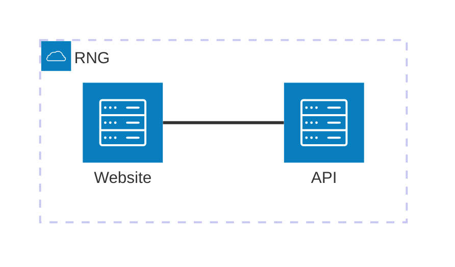

# Docker 101

How would you run a .NET app on Azure? You could provision a VM, then connect to it and install .NET, download your app binaries, set up the configuration and start the app. It's hard to automate all those steps, time-consuming to spin up a new instance and difficult to keep multiple instances in sync. Or you could use App Service, but there's still a lot to set up and you end up with a different hosting environment than you have locally.

Enter Docker - where you build all your application components and depdencies into a package called an _image_ and use that to run instances of your apps called _containers_. Lots of Azure services let you run apps in containers and it's a very powerful developer experience: you can use Docker on your machine to run the exact same app that you run in the cloud.

## Reference

- [Docker Desktop](https://www.docker.com/products/docker-desktop/) - the easiest way to run containers on your local machine
- [Dockerfile reference](https://docs.docker.com/reference/dockerfile/)
- [Compose file reference](https://docs.docker.com/reference/compose-file/)
- [.NET container images](https://hub.docker.com/_/microsoft-dotnet) - .NET cross-platform images
- [.NET Framework container images](https://hub.docker.com/_/microsoft-dotnet-framework) - .NET 3.5 & 4.8 Windows images

## Running web apps in containers

We'll run containers locally first and later see our options for running them in Azure. Make sure you have Docker Desktop running - you'll see the Docker whale icon in your taskbar (if you're running on Windows and you've used Docker Desktop before, be sure you're in _Linux container mode_).

You use the `docker` command to run and manage containers. It has built-in help text, just like the `az` command:

```
docker --help
```

Container apps are distributed in packages called _images_. You download an image from a package repository using the `docker pull` command:

```
docker pull nginx:alpine
```

> This downloads all the files which are part of the Docker image for running the Nginx web server in a container.

The command you'll use most to start with is `docker run` which starts a new container from an image. Run this command to start a simple web server in a container:

```
docker run -d -p 8081:80 nginx:alpine
```

You'll see lots of output, ending with a long random string which is the unique ID of your new container. What has the command done?

- it runs a container from the `nginx:alpine` Docker image which you just pulled. It has the Nginx web server installed and configured on an Alpine Linux OS base

- the `-d` flag puts the container in the background, so it carries on running when the command returns

- `-p` publishes a port on the container, so Docker can route network traffic into the container. For this container Docker will listen on port `8081` of your machine and send any traffic into port `80` of the container.


> Now browse to http://localhost:8081 and you'll see a response from your new web server.

You use other `docker` commands to manage your container apps:

```
# list running containers:
docker ps

# get the logs from a container:
docker logs <container-id>
```

📋 Run another container from Microsoft's **ASP.NET sample app** image - you can search for it on [Docker Hub](https://hub.docker.com) (try _dotnet-samples_ as the search term). Run your ASP.NET container in the background and publish port `8082` from your machine to port `8080` in the container.

<details>
  <summary>Not sure how?</summary>

Search for [dotnet-samples on Docker Hub](https://hub.docker.com/search?q=dotnet-samples&badges=verified_publisher) and you'll find a page that lists all the images, with [microsoft/dotnet-samples](https://hub.docker.com/r/microsoft/dotnet-samples) at the top. That shows you there's a sample app in the image called `mcr.microsoft.com/dotnet/samples:aspnetapp`.

```
docker run -d -p 8082:8080 mcr.microsoft.com/dotnet/samples:aspnetapp
```

</details><br/>

> When your new container is running, browse to http://localhost:8082

Is your Nginx app still running? What version of .NET is inside the container? Can you print the logs from the ASP.NET sample app?

## Understand runtime & SDK images

Microsoft owns the Docker images for .NET and publishes different variations on the [Microsoft Artifact Registry](https://mcr.microsoft.com/). You've seen ASP.NET for web apps, there are also .NET runtime images for console apps and SDK images you can use to build applications.

You can run a container interactively, so you connect to a shell session in the container. This is like creating a VM in the cloud and running SSH to connect.

Run an interactive container from the base ASP.NET image and you can explore the environment:

```
docker run -it --entrypoint sh mcr.microsoft.com/dotnet/aspnet:8.0

dotnet --list-runtimes

dotnet --list-sdks

exit
```

You'll see the .NET and ASP.NET runtimes are installed, but there are no SDKs. You can use this image to run compiled apps, but not to build apps from source code.

📋 Run an interactive container from the .NET **SDK** image, which you can find listed on Docker Hub. Use it to create and run a new console application.

<details>
  <summary>Not sure how?</summary>

There's a separate image for the [.NET SDK](https://hub.docker.com/_/microsoft-dotnet-sdk/):

```
docker run -it --entrypoint sh mcr.microsoft.com/dotnet/sdk:8.0
```

That gives you a shell session inside the container, which has the .NET runtime and SDK installed.

Now you can create and run an app:

```
dotnet new console -o labs-docker

cd labs-docker

dotnet run
```

</details><br/>

When you run the new app you'lll see the standard _Hello, World!_ output. If this reminds you of the Azure Cloud Shell experience, those shell sessions actually run in containers behind the scenes.

Now leave the interactive container and come back to your terminal session:

```
exit
```

## Building .NET apps in containers

Building apps inside a container is a good way of experimenting, but the real value of Docker is in packaging your own Docker images:

- this [Dockerfile](/src/simple-web/Dockerfile) is a script which packages an ASP.NET app in Docker. It uses the SDK image to build the app and the ASP.NET image to run the app.

There's a lot more you can do with Dockerfiles, but this is a good start. You can build and run a .NET app - or try a new release of .NET - without installing .NET on your machine.

Run this to build an image called `simple-web` from the Dockerfile and the source code:

```
docker build -t simple-web src/simple-web
```

You'll see Docker print the output from `dotnet` commands, building and compiling the app..

📋 Run a background container from the new image and publish port `8083` from your machine to port `8080` in the container.

<details>
  <summary>Not sure how?</summary>

It's the same `docker run` command.

The image name can be a reference to Docker Hub or Microsoft Artifact Registry, or to a local image:

```
docker run -d -p 8083:8080 simple-web 
```

</details><br/>

> Browse to http://localhost:8083 to see the app

The app is very simple, but you have the source code so you can make changes. Make some edits to the code in the `src/simple-web/src` folder and run the build command again to package up your changes. Test it by running a new container - you can't repeat the same `docker run` command though - why is that?

## Pushing images to a registry

Container images are stored on a registry for public (or private) access. You pull images to download them and you push images to share your own apps to a registry. Azure has its own image registry service, but for a quick start try pushing to Docker Hub.

**You need a (free) Docker account to push to Docker Hub. Sign up at https://app.docker.com/signup**.

To push images you need to authenticate to Docker Hub, and name the image with your username. It's easier if you store your usrname in a variable:

```
# with PowerShell:
$USER='<your-docker-username>'

# OR with Linux shells:
USER='<your-docker-username>'
```

> I'm using PowerShell and my Docker user id is _sixeyed_, so I'll run `$USER='sixeyed'`

Log in with the Docker command line - you will be prompted for your password:

```
docker login -u $USER
```

Now you add your username to an image by _tagging_ it, which basically gives it a new alias. Tag the web image you just built:

```
docker tag simple-web "$USER/simple-web:az-204"
```

And now you can push it to Docker Hub:

```
docker push "$USER/simple-web:az-204"
```

Browse to Docker Hub and you will see your image listed.

> By default Docker Hub images are publicly available, so now anyone could run a container from your version of the app using a single Docker command.

## Building and running distributed apps with Docker Compose

Running individual apps in containers is straightforward, but Docker also supports distributed app with multiple components running in diffrerent containers. That could be a microservices architecture or a web app and a database - it's all just containers to Docker.

Docker creates a virtual environment for each container which includes the networking stack. Docker networks are virtualized and containers connected to the same network can communicate using all the usual transports.

You can create networks and containers individually with the Docker CLI, but for more complex apps it's better to model them using Docker Compose. We'll deploy a simple distributed app which runs a website for generating random numbers, with the numbers provided by a backend REST API:



Here's how that's modelled in Compose:

- [docker-compose.yml](/src/rng/docker-compose.yml) - a Compose file for the random number app

Some of the Azure services support the Compose format, so it's good to be familiar with it (although you don't need to know it in detail). The basics: 

- a `service` represents a component running in a container
- the service configuration encapsulates the options you would put in `docker run`
- `networks` can be defined and services attached to the same network can communicate
- containers use the service name as the DNS name to find each other

📋 Run the app using a `docker compose` command with the file path `src/rng/docker-compose.yml`. Test that the web application works by browsing and getting a random number.

<details>
  <summary>Not sure how?</summary>

`compose` is a command group - print the help and you will see the `up` command looks good:

```
docker compose --help

docker compose up --help
```

Compose assumes you are using a file called `docker-compose.yml` in the current directory. Use the `-f` flag to specify the path:

```
docker compose -f src/rng/docker-compose.yml up
```

</details><br/>

You'll see lots of logs printed - Docker attaches to the containers and displays the logs unless you start in `detached` mode.

> Browse to http://localhost:8080 and you should be able to click the button and get a random number.

Those containers are running from my images pushed to a public registry but you can also use Docker Compose to build images from source code.

This Compose file has `build` sections specified which tell Docker where to find the Dockerfiles:

- [docker-compose.yml](/src/rng/docker-compose-build.yml) - the same Compose spec but with build information
- [Dockerfile for the API](/src/rng/Numbers.Api/Dockerfile)
- [Dockerfile for the web app](/src/rng/Numbers.Web/Dockerfile)


📋 Stop the app you're running and use a `compose` command to build your own images from the file `src/rng/docker-compose-build.yml`. Run the app from your own images in detached mode.

<details>
  <summary>Not sure how?</summary>

`compose` is a command group - there's a `build` command:

```
docker compose --help

docker compose build --help
```

If your app is still running from `compose up` you can exit by hitting Ctrl-C / Cmd-C. 

Now build your images:

```
docker compose -f src/rng/docker-compose-build.yml build
```

And run detached containers:

```
docker compose -f src/rng/docker-compose-build.yml up -d
```

</details><br/>

Compose uses the same Docker Engine to build the app as if you had run `docker image build` commands. Any images referenced in the Dockerfiles which you don't have will be pulled as part of the build.

Your app should be working in the same way as before. This is the power of Docker - you can get complex apps running on your own machine and then deploy them to an Azure service knowing they have all the dependencies and config they need.


## Lab

Container images are static packages - they're really just like ZIP files with all your application binaries and dependencies, the runtime and operating system tools. Image names often include a version number, and you can publish different images for different versions of your app. Wherever you run a container from the image, on your machine or in an Azure service, the app will always behave in the same way, because the starting point is always the same.

Typically things change between environments, so you need a way to inject configuration settings into the app when you run a container. The simplest way to do that is with _environment variables_, which you can set when you run the container and get read by the .NET configuration system. The simple web app uses a config setting to show the environment name - run a new container listening on port `8084` which shows the environment name `PROD` on the homepage.

> Stuck? Try [hints](hints.md) or check the [solution](solution.md).

___

## Cleanup

You'll have lots of containers running, but containers are intended to be disposable.

Run this command to remove them all:

```
docker rm -f $(docker ps -aq)
```
